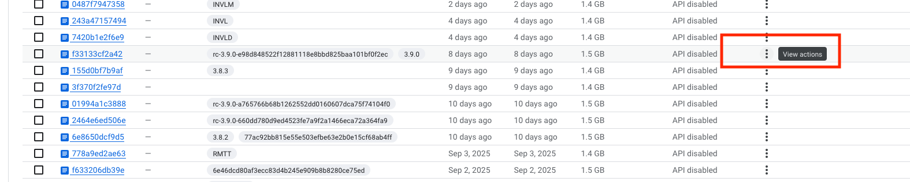

<!--
Add the issues included in the release and update this document as release tasks are completed.
-->

### Issues in Release
- [ ] Issue 1 by @example-gh-user
- [ ] Issue 2 by @example-gh-user2

<!-- Update the checklist as items are completed -->
### Beta Deployment
- [ ] Diff RC to master to identify and update helm chart for the following files:
  * hydroshare/settings.py
  * hydroshare/local_settings.py
- [ ] Determine whether maintenance page will be needed (db migrations etc)
- [ ] Add any management commands necessary for the deploy to the notes section
- [ ] Deployed to Beta
  - [ ] Run collectstatic if it is not run as part of the deployment
  - [ ] Kill the innactive HS pod and let it come back up
- [ ] Review the search and discovery pages
- [ ] Create a new user and update profile
- [ ] Create a new resource, check sharing/permission settings, delete new resource
- [ ] Developers test around issues
- [ ] Hsclient tests pass when targeting beta
  - [Replace with your passing HSclient run](https://github.com/hydroshare/hsclient/actions/runs/17570029473)
- [ ] QA testing around issues
- [ ] Stakeholders approval

<!-- Update the checklist as items are completed -->
### Production Deployment
- [ ] Make manual changes to the Production charts identified in Beta Deployment
- [ ] Connect to the prod cluster
  - `gcloud container clusters get-credentials hydroshare-prod --region us-central1`
- [ ] check for unreleased changes in helm charts
  - `helm diff upgrade hydroshare . --reset-values --values values.prod.yaml`
- [ ] Retag if needed (for example if it was tagged as an "rc-")
  * Add a tag in the [Cloud Artifact Registry](https://console.cloud.google.com/artifacts/docker/hydroshare-403701/us-central1/hydroshare/hydroshare?project=hydroshare-403701) or using `gcloud artifacts docker tags add us-central1-docker.pkg.dev/hydroshare-403701/hydroshare/hydroshare:old-tag new-tag`
  * Also add a tag in the Hydroshare repository if it hasn't been added yet, for example: `git tag 3.9.0 <rc_commit_hash> && git push origin 3.9.0`
- [ ] Deploy to Production
  * Run collectstatic if it is not run as part of the deployment
  * Kill the innactive HS pod and let it come back up
- [ ] Review the search and discovery pages
- [ ] Create a new user and update profile
- [ ] Create a new resource, check sharing/permission settings, delete new resource
- [ ] Update the version in the footer via the [Mezzanine admin](https://www.hydroshare.org/admin/theme/siteconfiguration/1/change/)
- [ ] Developers test around issues
- [ ] Close the release checklist (GitHub issue)
- [ ] Create a [new release in GH](https://github.com/hydroshare/hydroshare/releases)
- [ ] Notify the team of the release

### Notes relevant to deployment
1. [Enter Notes here]

### Diff

[Replace this with your actual diff](https://github.com/hydroshare/hydroshare/compare/3.8.2...rc-3.9.0-e98d848522f12881118e8bbd825baa101bf0f2ec)
