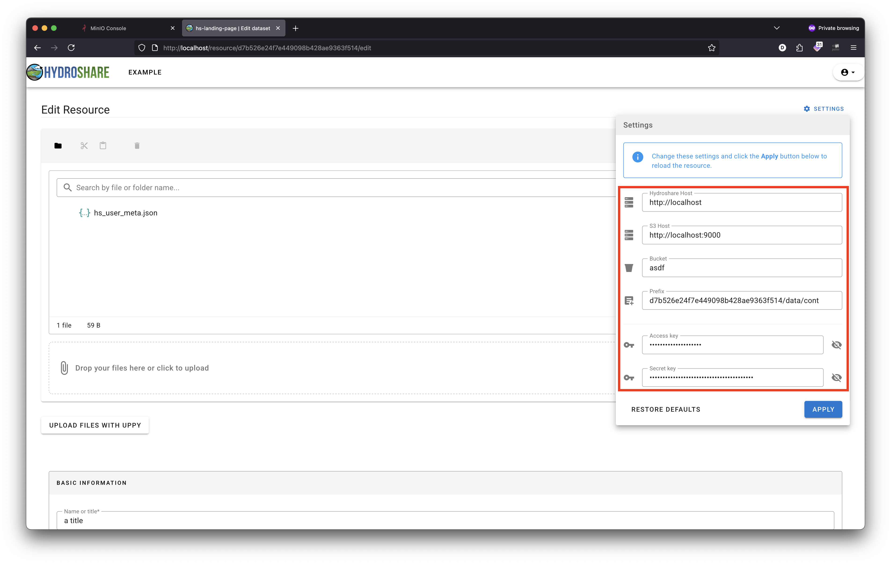

# HydroShare _(hydroshare)_

HydroShare is a website and hydrologic information system for sharing hydrologic data and models aimed at giving users the cyberinfrastructure needed to innovate and collaborate in research to solve water problems. HydroShare is designed to advance hydrologic science by enabling the scientific community to more easily and freely share products resulting from their research, not just the scientific publication summarizing a study, but also the data and models used to create the scientific publication. With HydroShare users can: (1) share data and models with colleagues; (2) manage who has access to shared content; (3) share, access, visualize and manipulate a broad set of hydrologic data types and models; (4) use the web services API to program automated and client access; (5) publish data and models to meet the requirements of research project data management plans; (6) discover and access data and models published by others; and (7) use web apps to visualize, analyze, and run models on data in HydroShare.

## Install

Prerequisites

Supported OS (developer laptops): macOS 10.12+, Win10+ Pro, Ent, Edu, Acad Pro, Acad Ent, CentOS 7 and Ubuntu/Lubuntu 18+ LTS

We got some troubles with Lubuntu 16.04 LTS so probably Ubuntu 16.04 LTS also does not work

Familiarity with docker and git are required to work with HydroShare

Some VM skills such as network settings (Bridge/NAT/Host only) and file sharing are needed if you work with a virtual machine.

For Windows, this link is required to proceed - https://docs.google.com/document/d/1wIQEYq3OkWmzPTHeyGyjXLZWrinEXojJPBTJq7fczL8/edit#heading=h.mfmd8m9mxvsl

     

One-Time Install

Tables are provided (in Courier font) throughout this wiki for copy-paste of entire blocks.

1. Open a terminal (macOS, Linux) or command prompt (Windows)
Navigate to where you will store the source code, for example /Users/yourname/repo/

Typically you will find it under this directory:
    
    cd ~/repo

2. Get code

Note it should have a default branch set to the develop branch

    git clone https://github.com/hydroshare/hydroshare.git

    git checkout <branch>

To get current solr revision fixes:

      a. git pull

cd hydroshare

    b. docker exec -ti hydroshare python manage.py solr_update

 
It’s very important that please DO NOT change the directory name after cloned. Let it be “hydroshare”
If you are running inside a virtual machine such as HydroDev Ubuntu 18.04 from here, you need to:

1. Log into Docker via application and command line.
Command line: 
    
    docker login 
    
    You will be asked to enter your username and password 

1. Launch the stack

        ./local-dev-first-start-only.sh

Following the screen instruction to continue.

Run the following command on completion to launch Hydroshare: 

    docker-compose -f local-dev.yml up 

5. Sanity Checks

    Some WARNINGs are normal. 

    HydroShare is available in your browser at http://localhost

    The default admin page is http://localhost/admin

    The default admin account is admin:default

    Swagger API docs http://localhost/hsapi/

6. Start & Stop & Log

To start HydroShare, only need to open a windows shell, change to HydroShare code directory then run

    docker-compose -f local-dev.yml (up | down) [-d] [--build]

Note bracketed -d for daemon is optional and you don’t paste in the brackets

    Use -d option in case you want to type new command on this windows or don’t want to see real-time output log.

    Use --build option in case docker keeps image in cache and does not update correctly while modifying the Dockerfile and working with PyCharm

CREATE NEW ACCOUNT - This is the same as it's always been in HydroShare. Ask a teammate or hack at it. Basically open a hydroshare console window then use the UI to sign up for a new account and watch the hydroshare container console (docker logs hydroshare) for a verification link and paste that into your browser and save the new account in the UI.


To stop HydroShare, only need to close the running windows or open a new windows then run

    docker-compose -f local-dev.yml down

All data is persisted for the next start.

To see the logs in case you start with -d option, open a windows then run

    docker-compose -f local-dev.yml logs

Or

    docker logs <container name>

Branching
When you activate a new branch, just bring the stack down and up again. Sometimes you can get away with a warm restart of the stack or even relying on the Django debug mode (doing nothing but waiting). 

## Usage

For all intents and purposes, Hydroshare is a large Python/Django application with some extra features and technologies added on:
- SOLR for searching
- Redis for caching
- RedPanda for concurrency and serialization
- Minio for a S3 file system
- PostgreSQL for the database backend

#### The `hsctl` Script

The `hsctl` script is your primary tool in interacting with and running tasks against your Hydroshare install. It has the syntax `./hsccl [command]` where `[command]` is one of:

- `loaddb`: Deletes existing database and reloads the database specified in the `hydroshare-config.yaml` file.
- `managepy [args]`: Executes a `python manage.py [args]` call on the running hydroshare container.
- `rebuild`: Stops, removes and deletes only the hydroshare docker containers and images while retaining the database contents on the subsequent build as defined in the `hydroshare-config.yaml` file
- `rebuild --db`: Fully stops, removes and deletes any prior hydroshare docker containers, images and database contents prior to installing a clean copy of the hydroshare codebase as defined in the `hydroshare-config.yaml` file.
- `rebuild_index`: Rebuilds the solr/haystack index in a non-interactive way.
- `restart`: Restarts the django server only.
- `start`: Starts all containers as defined in the `docker-compose.yml` file.
- `stop`: Stops all containers as defined in the `docker-compose.yml` file.
- `update_index`: Updates the solr/haystack index in a non-interactive way.

## Testing and Debugging

### Testing

Tests are run via normal Django tools and conventions. However, you should use the `hsctl` script mentioned abouve with the `managepy` command. For example: `./hsctl managepy test hs_core.tests.api.rest.test_resmap --keepdb`.

There are currently over 600 tests in the system, so it is highly recommended that you run the test suites separately from one another.

### Debugging

You can debug via PyCharm by following the instructions [here](https://docs.google.com/document/d/1w3hWAPMEUBL4qTjpHb5sYMWEiWFqwaarI0NkpKz3r6w/edit#).

## Other Configuration Options

## Contribute

There are many ways to contribute to Hydroshare. Review [Contributing guidelines](https://github.com/hydroshare/hydroshare/blob/develop/docs/contributing.rst) and github practices for information on
1. Opening issues for any bugs you find or suggestions you may have
2. Developing code to contribute to HydroShare 
3. Developing a HydroShare App
4. Submiting pull requests with code changes for review

## License 

Hydroshare is released under the BSD 3-Clause License. This means that [you can do what you want, so long as you don't mess with the trademark, and as long as you keep the license with the source code](https://tldrlegal.com/license/bsd-3-clause-license-(revised)).

©2017 CUAHSI. This material is based upon work supported by the National Science Foundation (NSF) under awards [1148453](https://www.nsf.gov/awardsearch/showAward?AWD_ID=1148453), [1148090](https://www.nsf.gov/awardsearch/showAward?AWD_ID=1148090), [1664061](https://www.nsf.gov/awardsearch/showAward?AWD_ID=1664061), [1664018](https://www.nsf.gov/awardsearch/showAward?AWD_ID=1664018), [1664119](https://www.nsf.gov/awardsearch/showAward?AWD_ID=1664119), [1338606](https://www.nsf.gov/awardsearch/showAward?AWD_ID=1338606), and [1849458](https://www.nsf.gov/awardsearch/showAward?AWD_ID=1849458). Any opinions, findings, conclusions, or recommendations expressed in this material are those of the authors and do not necessarily reflect the views of the NSF.

## Create a dummy resource for landing page work

* Pull the [6016/landing-page-squash-rebase](https://github.com/hydroshare/hydroshare/tree/6016/landing-page-squash-rebase) branch
* run `./local-dev-first-start-only.sh`
* Access hydroshare at http://localhost

Then...

### move the metadata .json files to the appropriate locations in minio
```
# the bucket is your hs username
export BUCKET=asdf
mc alias set local-hydroshare http://localhost:9000 cuahsi devpassword
docker exec -u hydro-service hydroshare python manage.py create_buckets asdf
mc cp landing-page/example_metadata/dataset_metadata.json local-hydroshare/$BUCKET/md/$DEFAULT_RESOURCE_ID/
mc cp landing-page/example_metadata/hs_user_meta.json local-hydroshare/$BUCKET/$DEFAULT_RESOURCE_ID/data/contents/
```

### go checkout the resource
* http://localhost/resource/d7b526e24f7e449098b428ae9363f514
* You should see the resource landing page.
* Click "Login" this will redirect you to: the [HS sign-in page](http://localhost/accounts/login/?next=http%3A%2F%2Flocalhost%2Fresource%2Fd7b526e24f7e449098b428ae9363f514)
* After login, it should redirect you back to the [landing page](http://localhost/resource/d7b526e24f7e449098b428ae9363f514)
* If you get an error, check the "Settings" in the upper RH corneer
Sometimes clicking the APPLY button will resolve the issue. This is a known bug that we need to resolve 
* If you want to see the old version of the resource, you can do so at http://localhost:8000/resource/d7b526e24f7e449098b428ae9363f514